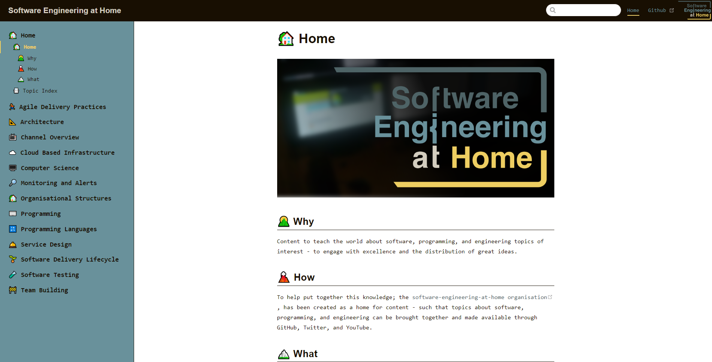

# Vuesite Template

A self hosted toolset for building interactive websites on top of Vuepress.

## Features

- Markdown driven website
- Interactive Vue components as first class citizen
- Auto-generated sidebar based on nested folder structure
- New components can be developed anywhere in the site root; and embedded into Markdown

## Hosting

- Hosted via GitHub pages
- Deployed automatically via GitHub Actions

If setup correctly (see below); you should be able to access this site on:
- https://connected-web.github.io/vuesite-template/

## Development Support

- Hot-reloading provided by Vuepress
- Mocha test framework included
- Linting included as part of tests
- Testing on PRs via Github Actions

## How to get started

- Make sure you have the latest version [Node LTS](https://nodejs.org/en/) installed
- Copy [this template in GitHub](https://github.com/connected-web/vuesite-template/generate)
- Check out the code locally
- Run: `npm install`
- Run: `node first-time-setup.js`
- Go to [Github > Settings > Pages](https://github.com/connected-web/vuesite-template/settings/pages) and enable publishing from the `gh-pages` branch

## Licenses

See: [LICENSE.md](./LICENSE.md)

The hosted vuesite packages together:

- @fortawesome/fontawesome-svg-core
- @fortawesome/free-solid-svg-icons
- @fortawesome/vue-fontawesome
- @vuepress/plugin-register-components
- @vuepress/theme-default
- axios
- time-until
- vuepress

Whilst the build tools require:

- @connected-web/md2json
- capture-website-cli
- chai
- eslint
- eslint-plugin-html
- eslint-plugin-mocha
- eslint-plugin-vue
- mocha
- node-localstorage
- promise-path
- standard

Which come with their own terms and conditions.
