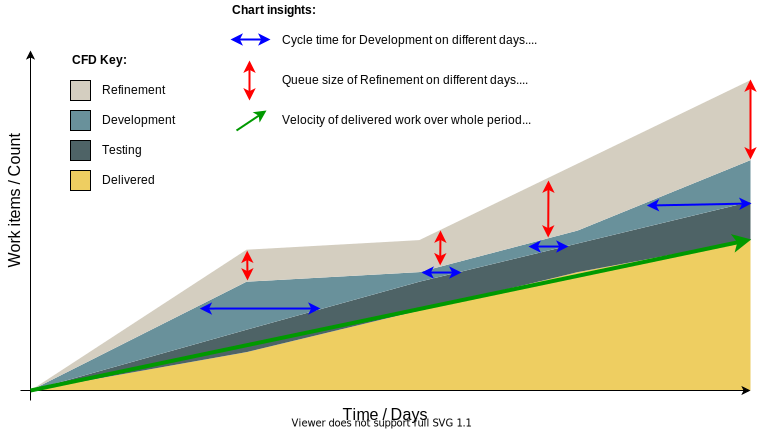

# 📈 Cumulative Flow Diagrams

You may have heard of the term velocity, or burn down charts in the context of sprints, to help assess the speed at which teams work through tasks. Cumulative Flow Diagrams, or CFDs, are used in the same context to view work over time as a graph, with time on the X axis, and completed tickets on the Y axis.

However, what makes CFDs more useful than a simple burn down chart is the aggregate of each queue state within a teams' process; that is, CFDs plot how much work is in all of the intermediary states between the team's backlog and their done / delivered pile, highlighting bottle necks, slowdowns, or accelerations in a team's velocity.

All this comes together to tell the story of a team's performance, their struggles, and potential problems forming.

## Common CFD Patterns

Lets take a look at some CFD patterns to give you a high level understanding of this tool in action.

### Normal Velocity

### Stalled Progress

Diagram 2. A CFD with a flat line

### Too much work in flight

Diagram 3. A CFD with an bulge in the middle

### The Exponential Backlog

Diagram 4. A CFD with an exponential backlog