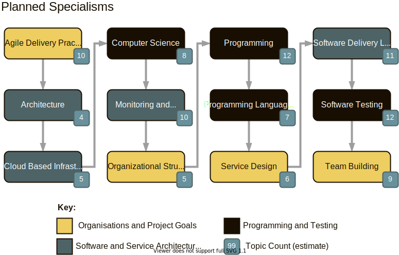
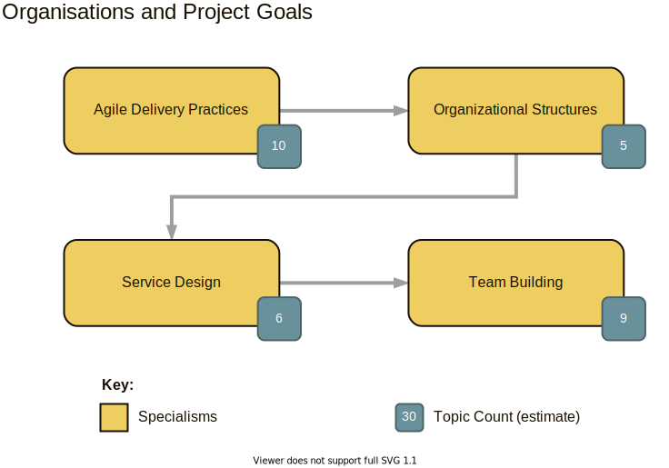
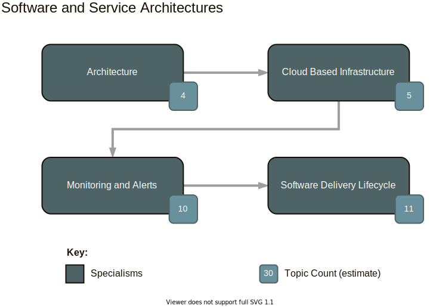
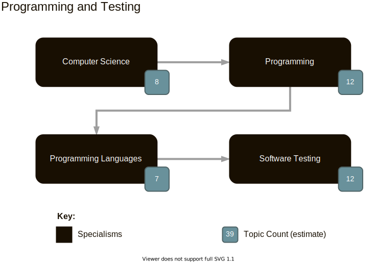

# Channel Introduction

???

This is the Software Engineering at Home channel introduction.

This content is formatted for slides; to launch the viewer please follow this link:
- https://software-engineering-at-home.github.io/content/slides.html?view=channel/000-Channel-Introduction.md

### Why

Introduce myself to the future audience, and give people an overview of the type of content to expect to find on the channel.

### What

By the end of the topic the audience should have a clear idea of:
- The channel title
- My name
- My background as a programmer, lead software engineer, and delivery manager
- The content and topics available
- That this is a growth project that will develop over time

### How

- By reading the details in this topic 
- By watching a face to camera video on youtube

### Supporting Material

- [x] Slide deck
- [x] Introduction to the onscreen branding
- [x] Onscreen topic list
- [?] Onscreen Twitter feed - with call to action to follow
- [?] Reminder about YouTube channel

---

name: who-am-i

## Who am I?

???

Hi and welcome to the Software Engineering at Home channel. My name is John and I'm a trained Software Engineer who's worked for the past 20 years either as a programmer, developer, or software engineer. I'm passionate about the field of Software Engineering; both from a hobbiest and professional perspective. I think engineering is a great mindset to have and there are lots of topics I'd like to explore through this channel.

Through my career so far I've had chance to work as a programmer, software team lead, delivery manager, and people manager. I've worked across the English speaking world for British, Australian and American companies, and have developed a sense for how big and small organisations work.

Over time I'll be growing the channel with new topics- many of which have been scoped out already as part of the planning for this channel. 

---

name: content-to-expect
class: diagram

## Content to Expect

???

The types of content I'll be producing on this channel fall into twelve main categories which I'm calling specialisms. Each specialism could be considered a field in itself - and will contain multiple topics.

For this summary; I've grouped the specialisms into three areas:

- Organisations and Project Goals
- Software and Service Architectures
- Programming and Testing

Each specialism contains a number of topics which I've sketched out over in the Software Engineering at Home github pages - over time each topic will end up with a dedicated write up, video, and eventually course material that you can follow at your own pace.

These are all areas I've grown fond of as part of working in the Software Industry over the course of 20 years. As I work through the content production process I'm hoping you'll be along to watch, and read, and ask me questions in the comments.

---

name: organisations-and-project-goals
class: diagram

## Content to Expect

???

In Organisation and Project goals I've chosen the specialisms of Agile Delivery Practices, Organisational Structures, Service Design, and Team Building. These specialisms will let me explore how teams of people approach shared goals, and how at the personal and interpersonal level you can organise yourself and the way you approach meaningful work.

---

name: software-and-service-architectures
class: diagram

## Content to Expect

???

In Software and Service Architectures I've chosen the specialisms of Architecture, Cloud Based Infrastructure, Monitoring and Alerts, and the Software Delivery Lifecycle. These specialisms will let me explore how to bring multiple software systems together as a complete and technically valuable product or service. 

---

name: programming-and-testing
class: diagram

## Content to Expect

???

In Programming and Testing I've chosen the specialisms of Computer Science, Programming, Programming Languages, and Software Testing. These specialisms will let me explore the bare metal approaches to instructing computers to do useful work - and help as a foundation to layering the higher level goals of large software systems.

### Writing Checklist

- [x] Set the premise - what's the topic, refer to the Why?
- [?] Tell a story - build a model around the premise using a real world story - either from personal experience or research.
- [?] Explain the story - explain how the story links back to the premise
- [?] Extract the value - identify the keys points from the story that explain the topic
- [?] Practical advice - add personal advice and guidance on top of the story

---

class: conclusion
name: like-share-and-support

## Like, Subscribe, and Support

### Get involved:

- Like and Subscribe on Youtube: [Software Engineering at Home](https://www.youtube.com/channel/UCoGJPjY5_Fh222iTw3wRE-w)
- Follow on Twitter: [@SoftwareAtHome](https://twitter.com/SoftwareAtHome)
- Support at Patreon: [SoftwareEngineeringAtHome](https://www.patreon.com/SoftwareEngineeringAtHome)
- Email questions to: [software@mkv25.net](mailto:software@mkv25.net)

~keep an open mind, and be kind to each other.

???

So welcome again to the Software Engineering at Home channel - I'm John, I've got a wealth of experience as a programmer, lead software engineer, and delivery manager that I'd like to share.

I hope you'll stay around for the content I'll be producing - the content will grow and develop over time.

So, if you liked this video - please subscribe - support the channel by subscribing on Patreon for early access to content; where you can ask questions and get answers - and finally let me know in the comments which topics you're most interested in.

I'm still working on tag lines, but for now- keep an open mind, and be kind to each other.

### Writing Checklist

- [/] Repeat the presmise, the key points, and the practical advice to close out the video
- [/] Like, subscribe, and share - support on patreon 

---

class: conclusion

## ⏭️ Where next?

You probably want to go back to the 📚 [Topic Index](./TOPICS.md) !